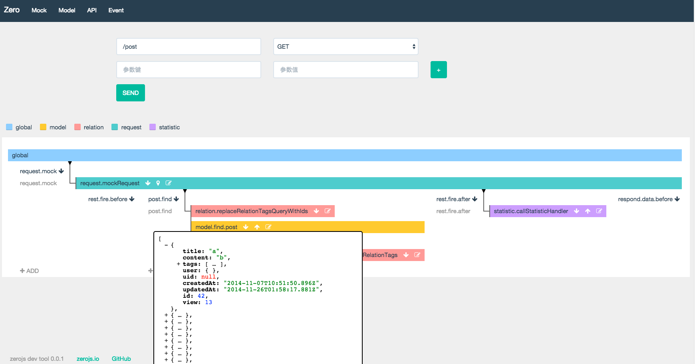

[](http://badge.fury.io/js/zero)
[](https://travis-ci.org/sskyy/zero)

## 1 Introduction

Zero is a node.js web framework. It can help you build robust and flexible applications in an extremely easy way.
The two main features that make zero different from other framework are:

### 1.1 Behavior-based Module System

Zero modules use a behavioral convention rather than a calling convention. Once a module is installed, provided behavior will be available to the system automatically without calling a single line of its api. For example, if you install the `user` module, the routers to handle login and registry is set, and the user model is built.
The purpose of behavior convention is to reduce the reduplicate work of implementing common logics, such as user login, to its limits. And the other beeifit is that it makes system more flexible for enable or disable behavior doesn't require code changing.
 
### 1.2 Advanced Event System

Using Zero build-in event Class to organize your business logic makes your system more flexible.With Zero Dev Tool installed, an interactive web interface is provided to trace the data flow and the event fire stack of any request.
This shares the same philosophy of not changing existing code with Behavior Based Module System.  
With this feature, we are planing on something really awesome called Cross Language Event. It will enable zero to trigger events handled by another zero system implemented in a different language like Go or Python. Once this work is done, developers can share or reuse all zero modules of any supported languages.


## 2 Quick start

Let's try to install a blog system [twenty](http://twentyjs.com) based on zero.


```
>  npm install zero -g
>  zero new blog
>  cd blog
>  zero install twenty

...waiting for twenty install...

>  cp modules/twenty/config.sample.js modules/twenty/config.js
>  node app
```

For further information to use the blog, please visit [https://github.com/sskyy/zero-twenty](https://github.com/sskyy/zero-twenty).

Developer are strongly suggestted to install dev tool(it is a module too) to explore the system.


```
>  zero install dev //at root of your application
```

Simply visit http://localhost:3000/dev/index.html to open dev tool. You should see something like this:



Zero dev tool is very powerful, you can checkout model definitions, mock any request to view the event fire stack and even edit event handler's code at realtime. Try it you self!  

Other awesome modules(or package) to play with:

 - [Nine](http://github.com/sskyy/zero-nine) A GTD application integrated with tomato clock. Remember remove twenty before install this one, this module use multiple user system which may conflict with twenty.
 - [Color](http://github.com/hi-caicai/color) A simple application for you to create your own color wall. Conflict with twenty too.

You may notice that there's no difference between a module and a application package, so mostly diffrent application can exist at same time.

## 3 basic usage

### 3.1 Creating application ###

Run `zero new <app_name>` in any directory.

### 3.2 Installing zero module ###

Simply execute `zero install <module_name>` in root of you application.

### 3.3 Creating zero module ###

Zero module follow the standard npm package rules, the only restrict is that you should name your module name start with `zero-` in package.json.

### 3.4 Using other zero module as dependency ###

Declare zero dependency in package.json like:

```
{
  "name":"zero-YOUR_MODULE_NAME",
  "zero":{
    "dependencies":{
      "DEPEND_MODULE" : "VERSION"
    }
  }
}
```

When zero start, module's instance will be passed to its dependency's `expand` method, so extra behavior can be extend to it. Visit [http://www.zerojs.io/modules](http://www.zerojs.io/modules) to checkout available module's and their's usage.

## 4 developer guide

We strongly suggest you explore the code of [twenty](http://github.com/sskyy/zero-twenty), which used the most of zero popular modules.
And try to install zero dev tool to see the real advantage of using zero. Some step by step guide are list below:

 - [How to use zero to develop a blog](./docs/en/how-to-use-zero-to-develop-a-blog.md)

## 5 I18n

 - [简体中文](./docs/zh-cn/README.md)

We need your PR for docs of other languages!


